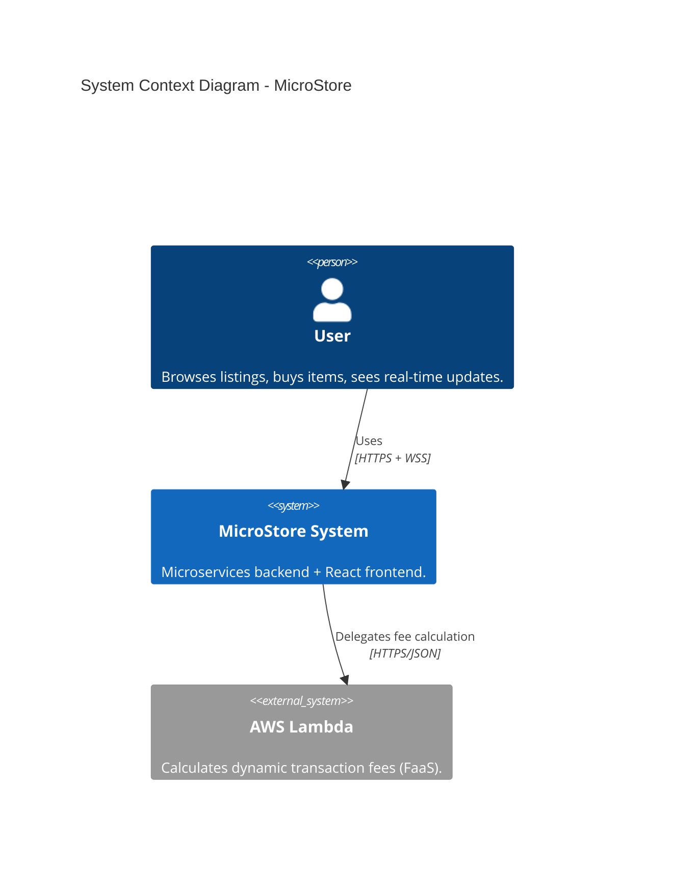
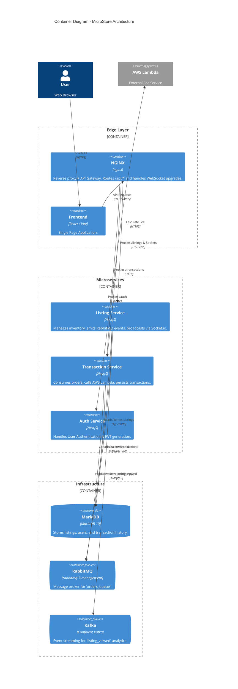
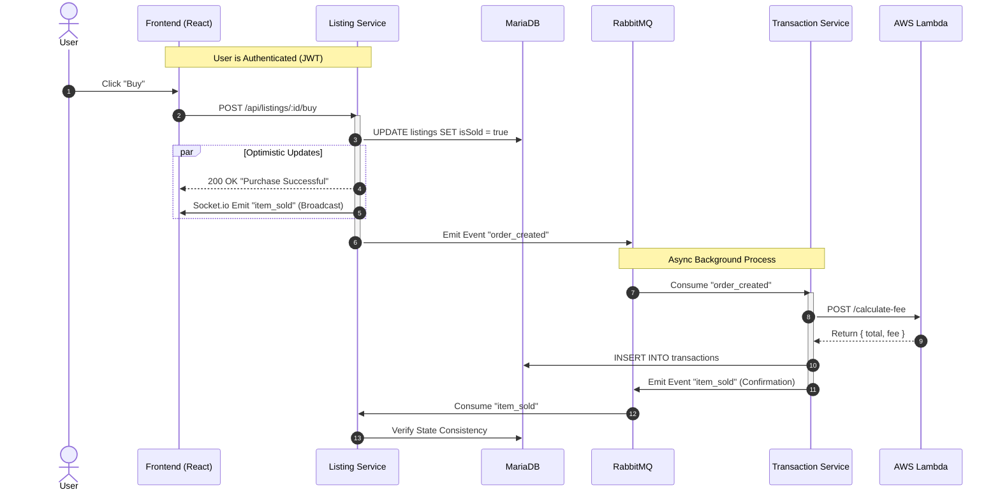

# SOA2026
---

# MicroStore System Documentation

This repository contains **MicroStore**, a distributed e-commerce system implemented as multiple **NestJS** microservices, fronted by **NGINX** and a **React** Single Page Application.

The system demonstrates:

* **Hybrid Architecture:** Synchronous HTTP + Asynchronous Messaging.
* **Microservices:** Listing Service, Transaction Service, Auth Service.
* **Event-Driven Communication:** Async messaging via **RabbitMQ** (Order Processing) and **Kafka** (Analytics/Views).
* **Real-Time Updates:** WebSockets via **Socket.io**.
* **Serverless Integration:** External Fee Calculation via **AWS Lambda**.
* **Containerized Deployment:** Docker Compose.

---

## 1. System Overview

The MicroStore system is designed as a set of independently deployable services:

* **Listing Service (NestJS):** Manages item inventory, handles "Buy" requests optimistically, and hosts the **Socket.io Gateway** for real-time `item_sold` broadcasts.
* **Transaction Service (NestJS):** Background worker that consumes orders, calculates fees via **AWS Lambda**, and saves permanent financial records.
* **Auth Service (NestJS):** Issues JWT tokens (login/register) to secure the API.
* **NGINX:** Reverse proxy acting as the API Gateway, routing traffic to backend services (`/api/listings`) and handling WebSocket upgrades.
* **Frontend (React/Vite):** The user interface for browsing and buying items.

---

## 2. C4 Model: System Context

This diagram shows how a user interacts with the MicroStore system and how the system relies on external cloud functions.



---

## 3. C4 Model: Container Diagram

This diagram breaks down the internal containers in the `docker-compose` stack.



---

## 4. UML Sequence Diagram: The "Buy Item" Flow

This diagram describes the **Hybrid Sync/Async** pattern used when a user purchases an item.



---

## 5. Technology Stack Summary

| Component | Technology | Role |
| --- | --- | --- |
| **Reverse Proxy** | NGINX | Single public entrypoint; routes requests; handles CORS. |
| **Backend Framework** | NestJS (Node.js) | Modular architecture for all microservices. |
| **Database** | MariaDB | Relational storage for all entities (Users, Listings, Transactions). |
| **Message Broker** | RabbitMQ | Handles the critical "Purchase" workflow (`orders_queue`). |
| **Event Streaming** | Kafka | Handles high-volume analytics events (`listing_viewed`). |
| **Real-time** | Socket.io | Bidirectional communication for live inventory updates. |
| **FaaS** | AWS Lambda | External serverless function for fee logic. |
| **Deployment** | Docker Compose | Orchestrates the entire stack locally. |

---

## 6. Run Locally (Quick Start)

From the root project folder:

```powershell
# Build and start all services
docker compose up -d --build

```

**Access Points:**

* **Frontend:** `http://localhost:8080` (Served via NGINX)
* **API Endpoint:** `http://localhost:8080/api/listings`
* **RabbitMQ Dashboard:** `http://localhost:15672` (User/Pass: guest/guest)
